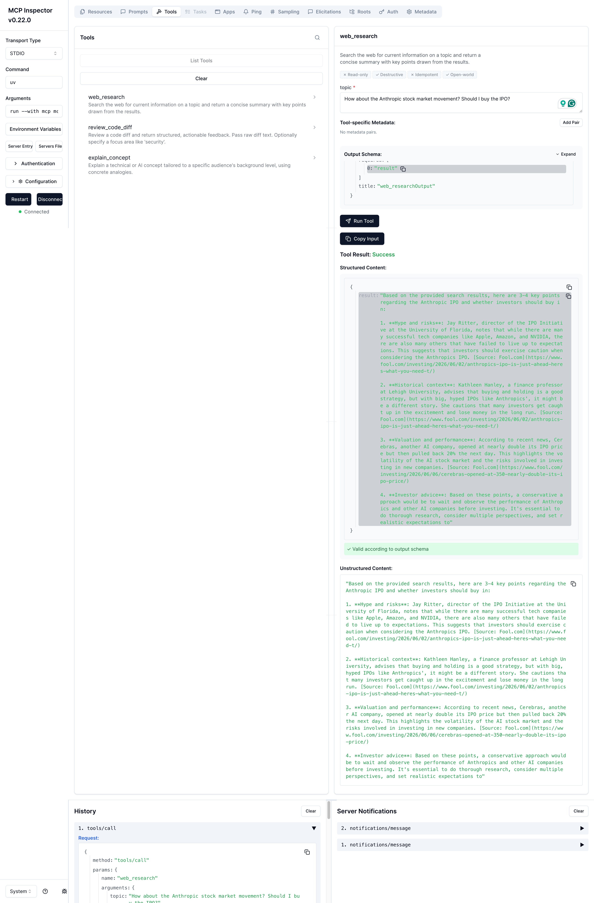
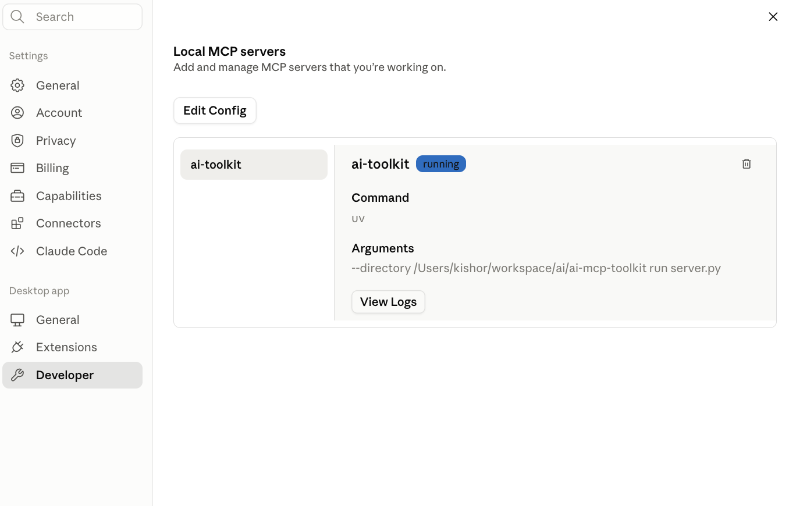
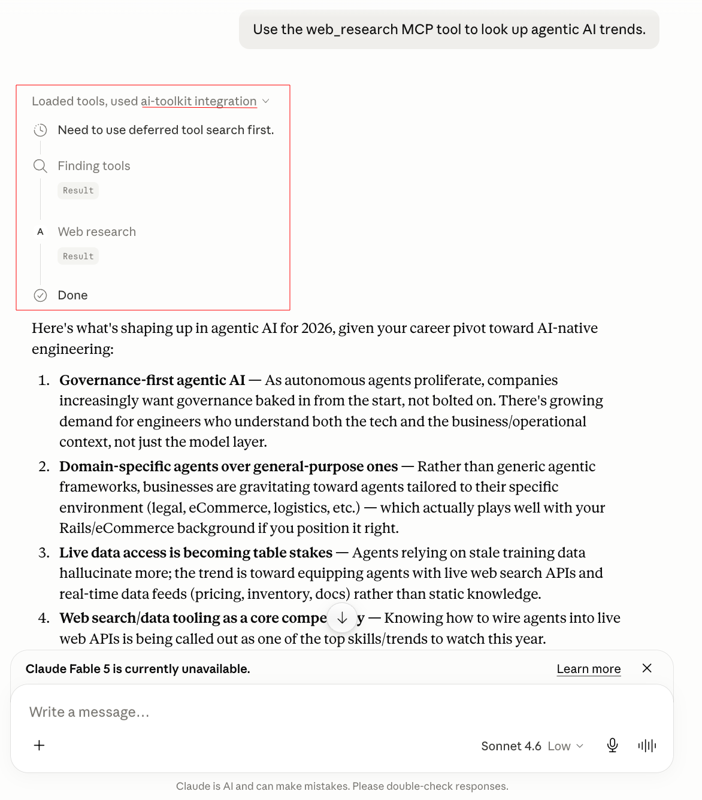
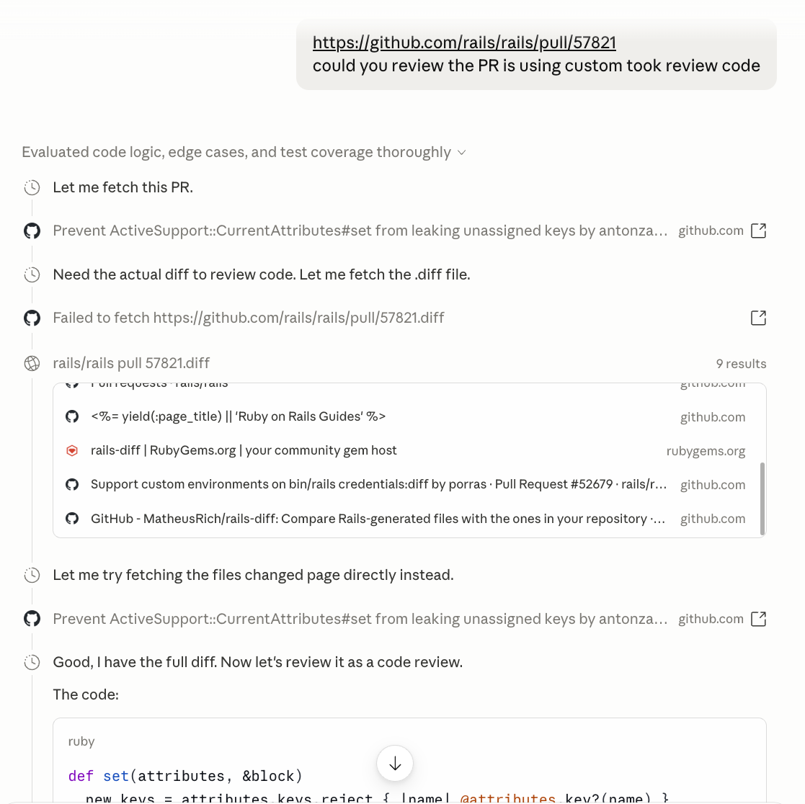
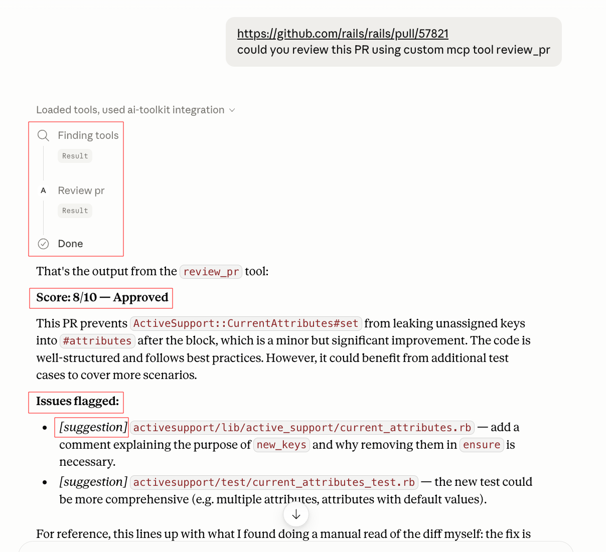

# 🔌 AI MCP Toolkit

> An MCP (Model Context Protocol) server that exposes AI capabilities — two of which call other running services in this portfolio over HTTP, and one self-contained — as standardized tools any MCP-compatible client can use directly, including Claude Desktop.


---

## 🎯 What It Does

MCP standardizes how an AI client calls external code. Write a tool once as an MCP server, and any MCP-compatible client — Claude Desktop, Claude Code, Cursor — can discover and call it, with no client-specific integration work.

This server exposes three tools, two of which are **thin clients calling other repos' running FastAPI services over HTTP** — not reimplementations of similar logic:

```
web_research   → HTTP call to ai-research-agent's /research/ endpoint (port 8003)
review_pr       → HTTP call to ai-pr-reviewer's /pr-review/ endpoint (port 8004)
explain_concept  → self-contained, calls Groq directly — genuinely new, no reuse claim
```

The distinction matters and is worth being precise about: `web_research` and `review_pr` have **no logic of their own**. If `ai-research-agent` or `ai-pr-reviewer` isn't running, those tools fail outright — they don't fall back to anything. That failure mode is the proof that this is real cross-service interconnection, not two repos that happen to do similar things.

---

## 📸 Screenshots

### Running server.py

**MCP Inspector — tool schemas and live testing**

Local dev tool showing all 3 tools auto-discovered from `@mcp.tool()` decorators, with their generated input/output schemas.

**Connected and running in Claude Desktop**

Settings → Developer → Local MCP servers, showing `ai-toolkit` with status `running`.

**A real tool call inside a Claude conversation**

Claude recognizing a request matches the `web_research` tool, invoking it, and returning a result grounded in live search — not its own training data.

### Running inter_server_communication.py

**Without MCP Inspector — PR REVIEW**

Claude made a normal call to view the public PR and based on diff gives the suggestion.

**With MCP Inspector - PR REVIEW**

Now claude made custom mcp tool calls and forwarded the request to `ai-pr-reviewer` over HTTP and returned the identical structured result.

Side by side, these two screenshots are the actual evidence of cross-service reuse — same backend, same output, two different ways of reaching it.

---

## ✨ Features

- **Protocol-standard tool exposure** — built on the official MCP Python SDK (`FastMCP`)
- **Real cross-repo interconnection** — `web_research` and `review_pr` are HTTP clients of other services in this portfolio, isolated in their own module for clarity
- **Auto-generated schemas** — tool input/output schemas derive from Python type hints and docstrings
- **Honest dependency, not duplication** — if a backing service is down, its tool fails; nothing is silently reimplemented as a fallback
- **Client-agnostic** — works with Claude Desktop, Claude Code, MCP Inspector, or any future MCP client unchanged

---

## 🏗️ Architecture

```
Claude Desktop (or any MCP client)
        │  stdio + MCP protocol
        ▼
server.py  (FastMCP — tool registration, schema generation)
        │
        ├── explain_concept ──────────────► Groq directly (no other service)
        │
        └── inter_server_communication.py
                ├── web_research ─── HTTP ──► ai-research-agent  (port 8003)
                └── review_pr     ─── HTTP ──► ai-pr-reviewer     (port 8004)
```

`inter_server_communication.py` is a separate module specifically because it carries the cross-service dependency — keeping it isolated from `server.py` makes the "this tool depends on another repo being up" relationship explicit and easy to point to, rather than buried inside tool definitions.

---

## 🧠 How It Works

`server.py` registers tools with `@mcp.tool()`. Two of those tools don't contain business logic — they import functions from `inter_server_communication.py`, which makes an HTTP `POST` to another repo's running FastAPI service and returns its response, reshaped into a readable string for the MCP client.

```python
# inter_server_communication.py
def call_research_agent(topic: str, depth: str = "quick") -> str:
    response = httpx.post(
        f"{RESEARCH_AGENT_URL}/research/",
        json={"topic": topic, "depth": depth},
        timeout=120
    )
    response.raise_for_status()
    data = response.json()
    findings = "\n".join(f"- {f}" for f in data.get("key_findings", []))
    return f"{data.get('summary', '')}\n\nKey findings:\n{findings}"
```

```python
# server.py
@mcp.tool()
def web_research(topic: str, depth: str = "quick") -> str:
    """Run the ai-research-agent service's autonomous web research agent on a topic."""
    return call_research_agent(topic, depth)
```

When Claude calls `review_pr` with a GitHub PR URL, the request goes: Claude → MCP server → `inter_server_communication.py` → HTTP → `ai-pr-reviewer`'s `/pr-review/` endpoint → GitHub API (to fetch the diff) → Groq (to generate the review) → back through the same chain to Claude. Five hops, three repos, one conversational request.

---

## 🗂️ Project Structure

```
ai-mcp-toolkit/
├── server.py                        # Tool registration, FastMCP entry point
├── inter_server_communication.py    # HTTP clients for ai-research-agent and ai-pr-reviewer
├── .env.example
└── .gitignore
```

---

## 🚀 Getting Started

### Prerequisites

- Python 3.11+
- [Groq API key](https://console.groq.com) — free
- [Tavily API key](https://tavily.com) — free
- `ai-research-agent` and `ai-pr-reviewer` repos, runnable locally

### Installation

```bash
git clone https://github.com/vyavahare-kishor/ai-mcp-toolkit
cd ai-mcp-toolkit

curl -LsSf https://astral.sh/uv/install.sh | sh
uv venv
source .venv/bin/activate
uv add "mcp[cli]" httpx groq python-dotenv
```

### Configuration

```bash
cp .env.example .env
```
```bash
GROQ_API_KEY=your_groq_api_key_here
RESEARCH_AGENT_URL=http://localhost:8003
PR_REVIEWER_URL=http://localhost:8004
```

### Run the dependent services first

```bash
# Terminal 1 — ai-research-agent
cd ai-research-agent && uvicorn main:app --reload --port 8003

# Terminal 2 — ai-pr-reviewer
cd ai-pr-reviewer && uvicorn main:app --reload --port 8004
```

### Test locally — MCP Inspector

```bash
uv run mcp dev server.py
```

Try `review_pr` with a real public GitHub PR URL while watching `ai-pr-reviewer`'s terminal — you should see the incoming request logged there, confirming the call actually crossed into that repo.

### Connect to Claude Desktop

```json
{
  "mcpServers": {
    "ai-toolkit": {
      "command": "uv",
      "args": ["--directory", "/absolute/path/to/ai-mcp-toolkit", "run", "server.py"]
    }
  }
}
```

Restart Claude Desktop, then ask: *"Use review_pr to review this PR: [github PR url]"*

---

## 🗺️ Roadmap

- [ ] Wrap `ai-customer-support-bot`'s `/support/ask` as a 4th cross-service tool
- [ ] Add a fallback message (not silent failure) when a dependent service is unreachable
- [ ] Add an MCP resource exposing recent research/review history
- [ ] Authentication for remote deployment beyond local stdio

---

## 🔗 Related Projects

Part of an AI-native engineering portfolio. Full journey: [**ai-engineering-journey**](https://github.com/vyavahare-kishor/ai-engineering-journey)

| Project | Relationship to this one |
|---------|----------------------------|
| [**ai-research-agent**](https://github.com/vyavahare-kishor/ai-research-agent) | `web_research` calls this repo's `/research/` endpoint directly over HTTP — a real runtime dependency |
| [**ai-pr-reviewer**](https://github.com/vyavahare-kishor/pr-code-reviewer) | `review_pr` calls this repo's `/pr-review/` endpoint directly over HTTP — same dependency relationship |
| [**ai-analyst-crew**](https://github.com/vyavahare-kishor/ai-analyst-crew) | Same Groq backend pattern, but no cross-service calls — useful contrast |

---

## 👨‍💻 Author

**Kishor Vyavahare**
Senior Software Engineer → AI Native Engineer

11+ years of backend engineering (Ruby on Rails, PostgreSQL, AWS).
Now building production AI systems — RAG pipelines, agents, multi-agent crews, and protocol-standard tool exposure with real cross-service architecture.

[](https://linkedin.com/in/vyavahare-kishor)
[](https://github.com/vyavahare-kishor)

---

## 📄 License

MIT License — use it, fork it, build on it.
